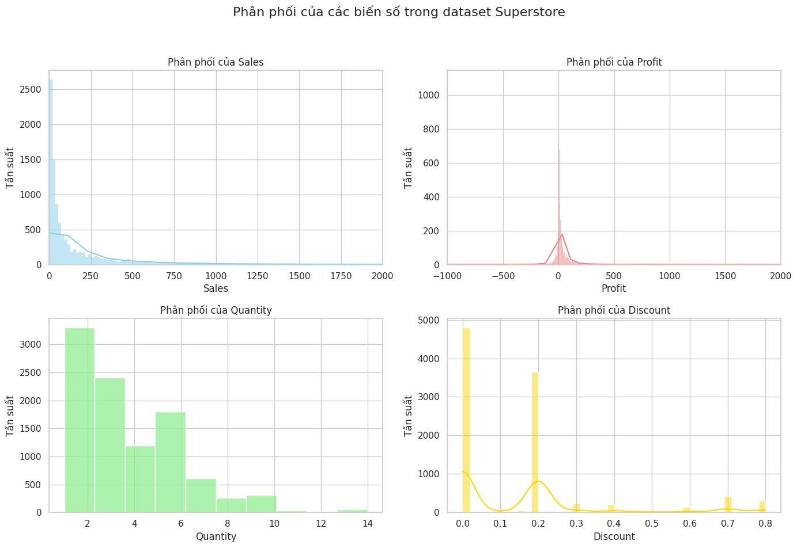
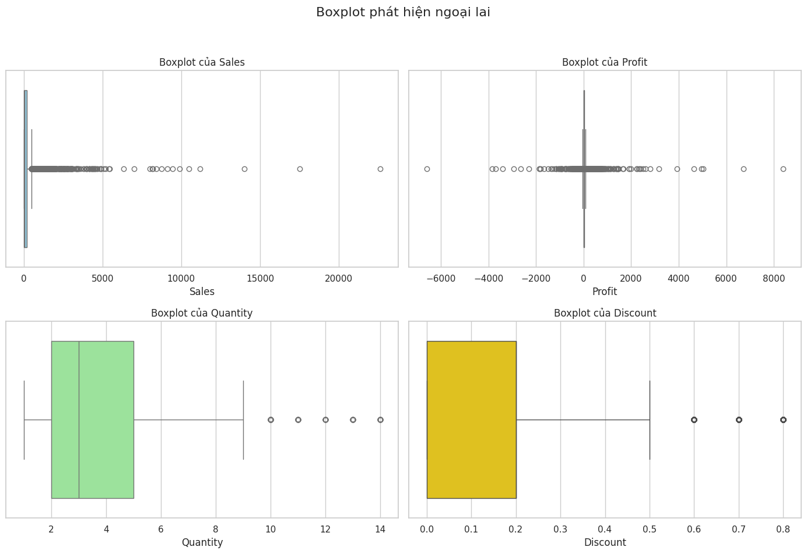
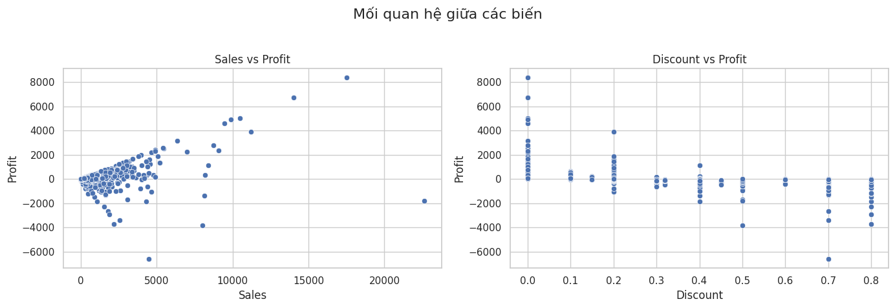
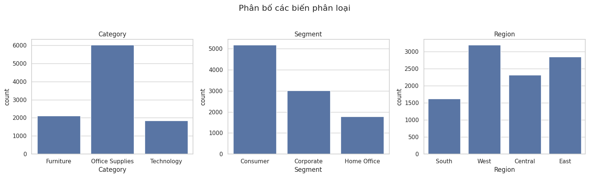
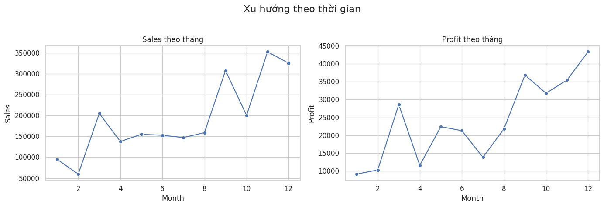
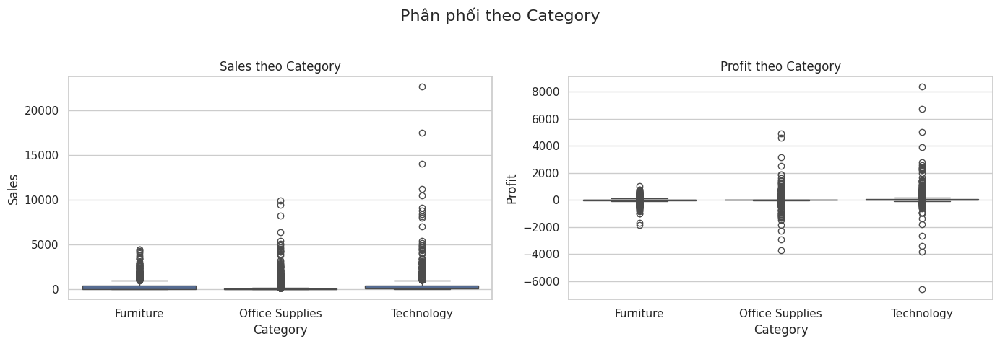
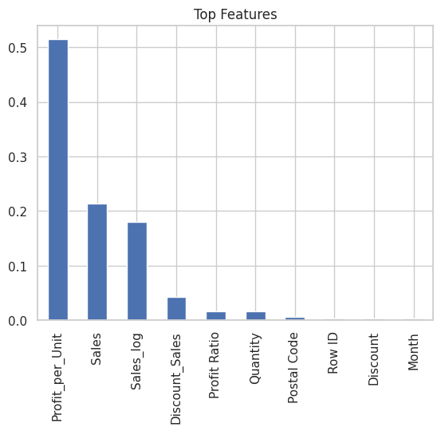
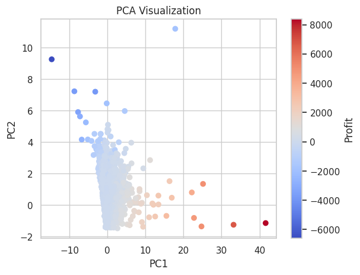

# Superstore Sales and Profit Analytics System

> End-to-end data analytics project on a 9,994-record US retail dataset —
> covering EDA, IQR outlier detection, feature engineering, multi-model
> regression benchmarking, and PCA visualization using Python.

---

## Overview

| Property | Detail |
|---|---|
| Dataset | Sample - Superstore (Kaggle) |
| Records | 9,994 transactions · 21 features |
| Period | 2015 – 2018 |
| Target variable | Profit |
| Language | Python |

---

## Model Benchmarking Results

| Model | R² Score |
|---|---|
| **Lasso Regression** | **0.7894** |
| Ridge Regression | 0.7875 |
| Linear Regression | 0.7871 |
| XGBoost | 0.7161 |
| Random Forest | 0.6496 |

Linear Regression: MAE = 26.55 · RMSE = 101.60

---

## Visualizations

### Distribution of Key Variables


### Outlier Detection via IQR


### Sales vs Profit · Discount vs Profit


### Orders by Category, Segment, Region


### Monthly Sales & Profit Trend


### Sales & Profit by Category


### Top Feature Importance (Random Forest)


### PCA Visualization (2 Components)


---

## Methodology

### 1. Data Loading & Inspection
- Loaded `Sample - Superstore.csv` (encoding=latin1)
- 9,994 rows · 21 columns · **0 missing values** after `dropna()`
- **0 duplicate rows**

### 2. Data Cleaning
- Converted `Order Date` and `Ship Date` from string → `datetime64`
- Verified dtypes across all 21 columns

### 3. Feature Engineering
Created 6 new columns:

| Feature | Formula | Purpose |
|---|---|---|
| `Year` | `Order Date.dt.year` | Temporal analysis |
| `Month` | `Order Date.dt.month` | Seasonal trend |
| `Month Name` | `Order Date.dt.strftime('%b')` | Readable labels |
| `Profit Ratio` | `Profit / Sales` | Efficiency metric |
| `Sales_log` | `log1p(Sales)` | Reduce right-skew |
| `Discount_Sales` | `Discount × Sales` | Interaction term |
| `Profit_per_Unit` | `Profit / Quantity` | Unit-level profitability |

### 4. IQR Outlier Detection

```python
Q1 = data[column].quantile(0.25)
Q3 = data[column].quantile(0.75)
IQR = Q3 - Q1
lower = Q1 - 1.5 * IQR
upper = Q3 + 1.5 * IQR
```

| Column | Lower Bound | Upper Bound | Outliers |
|---|---|---|---|
| Sales | -271.71 | 498.93 | **1,167** |
| Profit | -39.72 | 70.82 | **1,881** |
| Quantity | -2.5 | 9.5 | 170 |
| Discount | — | — | detected |

### 5. EDA Visualizations
- **Histogram** (4 panels): right-skewed Sales, bimodal Profit with negatives,
  Quantity concentrated at 1–5, Discount concentrated at low values
- **Boxplot** (4 panels): confirmed outliers in Sales and Profit
- **Scatter plot**: Discount negatively correlated with Profit
- **Count plot**: Office Supplies dominates Category; Consumer leads Segment
- **Line chart**: Monthly Sales/Profit trend — peak in November–December
- **Boxplot by Category**: Technology has highest Sales spread

### 6. Modeling Pipeline
- One-Hot Encoding: Category, Segment, Region (`drop_first=True`)
- Dropped non-numeric and date columns
- Train/Test split: 80/20 (`random_state=42`)
- Models trained: Linear Regression, Ridge (α=1.0), Lasso (α=0.1),
  Random Forest, XGBoost

### 7. PCA (2 Components)
- Features: Sales, Quantity, Discount, Profit
- Standardized with `StandardScaler`
- 2D scatter colored by Profit → reveals profit distribution clusters

---

## Key Findings

- **Discount is the primary driver of negative Profit** — transactions
  with high discount consistently show negative or near-zero profit margin.
- **Lasso Regression outperforms all models** (R²=0.7894), suggesting
  feature sparsity: many engineered features are redundant.
- **1,881 profit outliers** (18.8% of data) — mostly deep-discount orders
  and high-value technology items.
- **November–December** show peak Sales and Profit — consistent with
  US retail holiday season.
- Total dataset: Sales = $2,297,201 · Profit = $286,397
  → **Overall profit margin = 12.5%**

---

## Project Structure

```text
Superstore-Sales-and-Profit-Analytics-System/
├── README.md
├── requirements.txt
├── .gitignore
├── data/
│   └── Sample - Superstore.csv
├── notebook/
│   └── Superstore Sales and Profit Analytics System.ipynb
└── assets/
    ├── histogram_distribution.png
    ├── boxplot_outliers.png
    ├── scatter_relationships.png
    ├── countplot_categories.png
    ├── linechart_monthly_trend.png
    ├── boxplot_by_category.png
    ├── feature_importance.png
    └── pca_visualization.png
---

## Data

Dataset not included due to size. Download from Kaggle:
https://www.kaggle.com/datasets/vivek468/superstore-dataset-final

Place the CSV in the `data/` folder and update Cell 0 of the notebook:
```python
df = pd.read_csv("../data/Sample - Superstore.csv", encoding='latin1')
```

---

## How to Run

```bash
git clone https://github.com/viet-anh-125/Superstore-Sales-and-Profit-Analytics-System.git
cd Superstore-Sales-and-Profit-Analytics-System
pip install -r requirements.txt
jupyter notebook notebook/Superstore Sales and Profit Analytics System.ipynb
```

---

## Tech Stack

`Python` · `Pandas` · `NumPy` · `Matplotlib` · `Seaborn` ·
`Scikit-learn` · `XGBoost` · `PCA` · `IQR Outlier Detection`

---

## Author

**Đào Việt Anh**